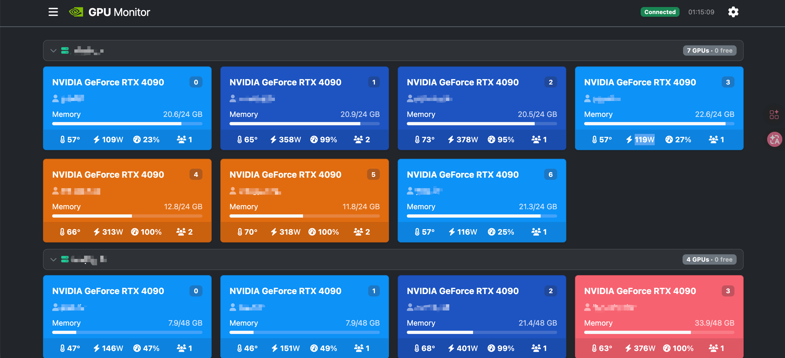
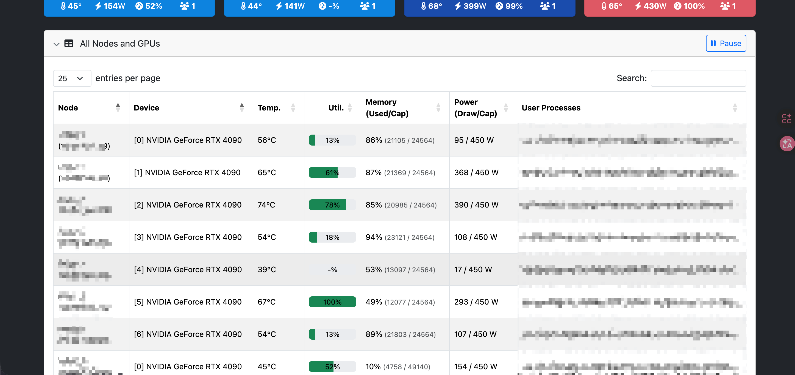

# GPU Monitor (Agentless SSH 版)


[](https://www.python.org/)
[](https://flask.palletsprojects.com/)
[](LICENSE)

---

## 📝 更新日志

- **2026-10-03**：新增 **服务器别名 (Alias)**、**凭据分离存储**、**仓库迁移**，以及多项界面改进：
  - **服务器别名**：每台节点可设置别名（≤64 字符），面板各处优先显示别名、悬停可查看真实主机名。添加节点时可填写，批量导入支持可选的第 5 列，也可在设置表格中**行内编辑**（回车 / 失焦保存），配套新增 `POST /api/admin/servers/rename` 接口。
  - **凭据分离存储**：`servers.json` 不再保存任何 SSH 敏感信息（仅存 `id`、`alias`），`hostname / port / username / password` 全部剥离至独立的 **`secrets.json`**（按服务器 `id` 索引），并提供 `secrets.example.json` 模板；`secrets*.json` 已默认加入 `.gitignore`。旧配置中的凭据会在首次保存时**自动迁移**，无需手动处理。
  - **仓库迁移**：仓库地址迁移至 **[Atmizz/GPU_Monitor](https://github.com/Atmizz/GPU_Monitor)**，提交作者变更为 **[Atmizz](https://github.com/Atmizz)**，并以全新初始提交重建历史（早期提交记录保留在原仓库及本地备份中）；README 同步更新克隆地址与致谢信息。
  - **GPU 卡片按服务器分组**：卡片按节点归入独立的**可折叠区块**，区块头实时显示 GPU 总数、空闲数徽章（带呼吸辉光）或 Offline 状态；折叠状态记忆在 `localStorage`，通过快捷筛选选中某台服务器时自动展开。
  - **空闲显卡绿色高亮**：无占用进程的显卡显示绿色「Free」胶囊 + 呼吸辉光动画，一眼锁定可用算力；**绿色从此专属表达「空闲」**，不再用于温度，配色图例更新为：绿=空闲、红=>75°C、黄=50-75°C、蓝=≤50°C、灰=离线/错误。
  - **All Nodes and GPUs 表格默认折叠**：底部数据表格默认收起，点击标题栏展开 / 收起，展开时自动重新校准列宽。


---

## 📸 截图预览





---

## 📖 项目简介 (Introduction)

这是一个基于 **Python + Flask** 开发的**轻量级 GPU 集群监控面板**，专为**深度学习课题组、实验室或小型服务器集群**设计。

与传统的监控方案（如 Prometheus + Grafana + Node Exporter）不同，本项目采用 **无 Agent (Agentless)** 架构：**无需**在被监控的 GPU 服务器上安装任何客户端、Python 包或常驻进程。只需在主控机上启动服务，即可通过 **SSH 协议**分布式采集所有节点的 GPU 数据。

> 一句话总结：**一台主控机 + 若干台带 NVIDIA 显卡且开启 SSH 的节点 = 完整集群监控。**

---

## 💡 致敬与改编说明 (Credits & Modifications)

感谢 [fgaim](https://github.com/fgaim/gpuview) 和 [YYYYYuanZi](https://github.com/YYYYYuanZi/GPUMonitor) 两位作者，本项目基于他们的工作改进而来。

**我的主要开发内容 (My Contributions):**

1. **服务器别名 (Alias)**：为每台节点设置易读别名（≤64 字符），添加 / 批量导入 / 设置表格行内编辑均可配置，新增 `POST /api/admin/servers/rename` 接口。
2. **凭据分离存储**：`servers.json` 仅保存节点的 `id` 与 `alias` 等非敏感字段，SSH 主机名 / 端口 / 账号 / 密码剥离至独立的 `secrets.json`（按 `id` 索引，已被 `.gitignore` 忽略），即使误提交配置文件也不会泄露凭据。
3. **分组折叠视图**：GPU 卡片按服务器归入可折叠区块，区块头实时显示 GPU 总数、空闲数徽章或离线状态，折叠状态本地记忆。
4. **空闲显卡绿色高亮**：空闲显卡显示绿色「Free」胶囊 + 呼吸辉光动画，绿色从此专属表达「空闲」，配色图例同步更新。
5. **表格默认折叠**：All Nodes and GPUs 数据表格默认收起，点击标题栏展开 / 收起，展开时自动校准列宽。

**继承自上游的核心优化 (Inherited from Upstream):**

- **架构进化 (Agentless)**：从原版的「每台机器必装 Agent」升级为 **SSH 直连模式**。被监控端只需有 NVIDIA 驱动并开启 SSH 即可，真正即插即用。
- **后端高并发优化**：引入 **SSH 连接池** 与 **Keep-Alive 机制**避免频繁建连开销，后台线程池轮询（上限 10）防止触发防火墙拦截或 SSH 拥堵，数据缓存于内存实现 API **毫秒级无感响应**，合并 `nvidia-smi` 显卡与进程指令、单次会话拉取全部数据。
- **前端体验重制**：全新 **深色模式 (Dark Mode)**、无闪烁平滑刷新，以及用户 / 空闲显卡 / 服务器快捷筛选按钮。
- **动态节点管理**：支持在前端 / API **动态添加、删除服务器、拖拽重排、批量导入**，配置自动持久化至 `servers.json`。

---

## ✨ 功能特点

| 特性 | 说明 |
| --- | --- |
| 🖥️ **零侵入 (Agentless)** | 被监控节点「即插即用」，不占用目标机多余常驻资源 |
| 👤 **用户级进程识别** | 通过 `nvidia-smi` 与 `ps` 命令联动，直观显示**哪个 Linux 用户 (`username`)** 正在运行什么进程、消耗多少显存，方便课题组协调算力 |
| 🔐 **高安全性** | 管理接口及配置返回时，自动**对 SSH 密码进行脱敏处理**；凭据与展示配置分离存储（`secrets.json` / `servers.json`），保障资产安全 |
| 🏷️ **服务器别名** | 为每台节点设置易读别名（≤64 字符），面板与 API 全面支持，添加 / 批量导入 / 行内编辑均可配置 |
| 🗂️ **分组折叠视图** | GPU 卡片按服务器分组为可折叠区块，区块头显示 GPU 总数、空闲数、离线状态，折叠状态本地记忆 |
| 🟢 **空闲高亮** | 无占用进程的显卡绿色「Free」胶囊 + 呼吸辉光，快速定位可用算力；颜色语义：绿=空闲、红=>75°C、黄=50-75°C、蓝=≤50°C |
| 📊 **全维数据** | 实时监控温度、显存、利用率、功耗（当前/限制）、进程详情 |
| ⏱️ **平滑刷新** | 前端每 2 秒无闪烁刷新；后端自适应轮询——有人看时约 1 秒，无人看时降为约 30 秒，减轻对节点的 SSH 压力 |
| 📦 **批量导入** | 设置弹窗中可按行粘贴 `hostname,port,username,password`，一次性导入多台节点 |
| 🔀 **拖拽重排** | 前端直接拖拽调整节点顺序，自动持久化 |
| 🧩 **动态节点** | 支持前端 / API 动态添加、删除服务器 |

---

## ⚙️ 环境要求

| 项目 | 要求 |
| --- | --- |
| 主控机 Python | 3.9+（推荐 3.10/3.11） |
| 主控机依赖 | `flask`、`paramiko` |
| 被监控节点 | NVIDIA 驱动 + `nvidia-smi` 可用 + SSH 服务开启 |
| 网络 | 主控机能以 SSH 访问各节点（22 端口或自定义端口） |

---

## 🛠️ 安装与使用

### 本地源码部署（开发 / 二次开发）

如果您需要进行二次开发或直接在宿主机运行：

```bash
git clone https://github.com/Atmizz/GPU_Monitor.git
cd GPU_Monitor

# 推荐使用虚拟环境
python -m venv venv
source venv/bin/activate      # Linux / Mac
# venv\Scripts\activate       # Windows

# 安装依赖
pip install flask paramiko

# 启动服务
python app.py
```

启动后，浏览器访问：**http://localhost:8888**

---

### 批量添加服务器

1. 启动服务，浏览器打开 `http://<主控机IP>:8888`
2. 点击右上角 **「设置」**
3. 添加节点：填写 `hostname`、`port`、`username`、`password`，可选填 **`alias`（别名，≤64 字符）** 用于面板显示
4. 保存后返回主页，即可看到各节点 GPU 实时状态（按服务器分组显示，空闲显卡带绿色高亮）

**批量导入格式**（每行一条，第 5 列别名为可选）：

```
hostname,port,username,password[,alias]
node1.lab.com,22,root,password123,lab-4090
192.168.1.101,22,ubuntu,mypass
192.168.1.102,2222,dl-user,secret,a100-node2
```

> 别名会显示在分组区块标题、快捷筛选按钮和数据表格中，悬停可查看真实主机名；之后也可在设置表格的 **Alias** 列中行内编辑（回车或失焦保存）。

---

## 📁 项目结构

```text
GPUMonitor/
├── app.py                  # Flask 主程序：路由 / SSH 采集 / 连接池 / 线程池 / 凭据分离存储
├── servers.json            # 节点展示配置（仅 id、alias，无敏感信息，自动生成）
├── secrets.json            # SSH 凭据（hostname/port/username/password，按 id 索引，自动生成，已被 .gitignore 忽略）
├── secrets.example.json    # secrets.json 格式模板
├── requirements.txt        # Python 依赖（flask、paramiko）
├── static/                 # 前端静态资源（Flask 默认 /static 路由提供）
│   ├── css/style.css       # 深色主题样式（分组折叠卡片 / 空闲高亮 / 快捷栏）
│   └── js/main.js          # 页面逻辑（数据渲染 / 筛选联动 / 节点管理）
├── templates/              # 前端页面模板
│   └── index.html          # 页面骨架（引用 static 下的 CSS / JS）
├── .gitattributes
├── .gitignore              # 忽略 secrets*.json 等敏感与缓存文件
└── README.md
```

> ⚠️ `secrets.json` 中保存的是节点的明文 SSH 凭据，**切勿提交至公开仓库**（`.gitignore` 已默认忽略 `secrets*.json`）。`servers.json` 自 v2026.10.03 起不再包含凭据，可放心持久化与备份；升级旧版本后，首次保存配置时会自动把旧配置中的凭据迁移到 `secrets.json`。

---

## 🔌 API 接口

以下为常用接口（具体以实际实现为准）：

| 方法 | 路径 | 说明 |
| --- | --- | --- |
| `GET` | `/` | 监控面板首页 |
| `GET` | `/api/gpustat/all` | 获取所有节点的实时 GPU 数据（内存缓存，含 `alias` 字段） |
| `GET` | `/api/admin/servers` | 获取节点列表（密码已脱敏剥离） |
| `POST` | `/api/admin/servers` | 新增节点，JSON body：`hostname`、`port`、`username`、`password`、`alias`（可选） |
| `POST` | `/api/admin/servers/bulk` | 批量导入节点，每行 `hostname,port,username,password[,alias]` |
| `DELETE` | `/api/admin/servers` | 删除节点，JSON body：`hostname` |
| `POST` | `/api/admin/servers/reorder` | 调整节点顺序（拖拽重排后调用） |
| `POST` | `/api/admin/servers/rename` | 设置 / 清除节点别名，JSON body：`hostname`、`alias`（空串清除，≤64 字符） |

**示例：获取所有节点实时状态**

```bash
curl http://localhost:8888/api/gpustat/all
```

```json
[
  {
    "hostname": "192.168.1.101",
    "alias": "lab-4090",
    "gpus": [
      {
        "index": "0",
        "name": "NVIDIA GeForce RTX 4090",
        "temperature.gpu": 68,
        "utilization.gpu": 87,
        "memory.used": 18432,
        "memory.total": 24576,
        "memory": 75,
        "power.draw": 320,
        "enforced.power.limit": 450,
        "user_processes": "alice(python,12000M)",
        "users": 1
      }
    ]
  }
]
```

节点离线时对应条目会带有 `"error"` 字段且 `gpus` 为空数组。

---

## 🔔 使用建议

- **并发限制**：后端采集线程数按节点数自动伸缩（上限 10），如节点数量大（>20），需注意防火墙阈值。
- **刷新频率与智能降频**：前端每 2 秒拉取一次缓存渲染；后端自适应轮询——只要近期有客户端拉取数据就保持约 1 秒全速轮询，连续约 10 秒无人拉取（页签关闭 / 前端 Pause / 后台标签页被浏览器节流）则自动降为约 30 秒一次，空闲期收到请求会立即唤醒采集线程，回来第一屏不会拿到过期数据。节奏可通过 `app.py` 顶部的 `POLL_INTERVAL_ACTIVE` / `POLL_INTERVAL_IDLE` / `CLIENT_ACTIVE_WINDOW` 常量调整。
- **安全加固**：面板默认监听 `0.0.0.0:8888`，如需公网访问，请务必置于反向代理（Nginx）+ 鉴权之下，或仅在内网使用。

---


## ⚠️ 安全提示

- 本项目通过 SSH 采集数据，**所有节点凭据保存在主控机上**，请确保主控机本身安全。
- **凭据分离存储**：`servers.json` 仅存节点 `id` 与 `alias`；`hostname / port / username / password` 均保存在 `secrets.json`（已被 `.gitignore` 忽略），请一并做好文件权限控制（如 `chmod 600 secrets.json`）。
- 面板**默认无登录鉴权**，请勿直接暴露在公网。
- 生产环境建议：
  1. 使用 SSH Key 替代密码
  2. 通过 Nginx 反向代理 + Basic Auth / OAuth 保护面板
  3. 限制面板仅内网访问
- 备份节点配置时，请**同时备份 `servers.json` 与 `secrets.json`**，只备份前者会丢失凭据。

---

## 🤝 贡献

欢迎提交 Issue 和 Pull Request。如果这个项目对你有帮助，请给个 ⭐ Star！

---

## 📄 License

本项目采用 **MIT License** 开源协议，完整条款见 [LICENSE](LICENSE)。

**第三方依赖**：本项目依赖 `Flask`、`paramiko` 等开源库，均遵循其各自的开源许可证。

---

## 🙏 致谢

- 原版项目：[fgaim/gpuview](https://github.com/fgaim/gpuview)
- 原仓库作者：[YYYYYuanZi](https://github.com/YYYYYuanZi)（开发与维护）
- 本仓库作者：[Atmizz](https://github.com/Atmizz)（深度二次开发与维护）

> 本项目仅供技术学习与研究使用，请遵守所在机构的网络与安全规范。
